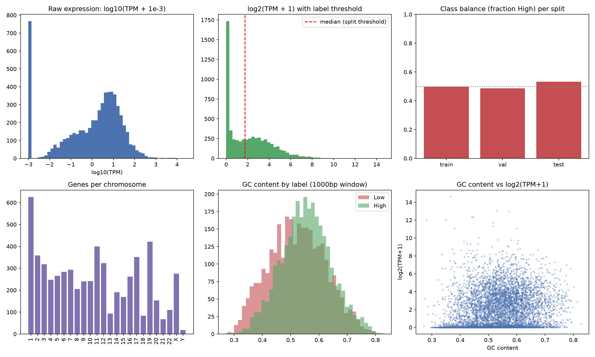

# Promoter-Expression Dataset: EDA Summary

*Generated by `src/eda.py --seq-len 1000`.*

## Dataset Summary

| Metric | Value |
|---|---|
| Genes in `raw_data.csv` | 5996 |
| Duplicate `gene_id`s | 0 |
| Missing `gene_symbol` | 12 |
| Zero-TPM genes | 766 (12.8%) |
| Raw TPM (min / median / mean / max) | 0.000 / 2.315 / 25.41 / 25339.7 |
| Train / val / test size | 4796 / 600 / 599 |
| Class balance (train / val / test) | 0.497 / 0.487 / 0.533 |
| Cross-split `gene_id` overlap | 0 (must be 0) |
| GC content (mean ± std) | 0.539 ± 0.095 |
| GC content, High-expression mean | 0.555 |
| GC content, Low-expression mean | 0.523 |
| GC content vs log2(TPM+1), Pearson r | 0.147 |

## Per-Graph Inference

### 1. Raw expression: log10(TPM + 1e-3) — top-left

Mean TPM (25.41) is roughly 11x median TPM (2.315), and the raw expression_value column has a skewness of 50.8 (a symmetric distribution would be ~0) -- both numbers quantify what the plot shows visually: a strongly right-skewed distribution typical of RNA-seq data, where the bulk of genes sit at low-to-moderate expression and a small number of genes (max=25340 TPM) are extreme outliers pulling the mean far above the median. The isolated spike at log10(TPM)=-3 is the 766 genes (12.8%) with exactly zero measured TPM in liver -- these are not missing data, they are genes GTEx measured and found genuinely undetectable in liver tissue (plausible: many genes are tissue-specific and simply off in liver). The +1e-3 offset is a plotting-only device to make this spike visible as a distinct bar instead of causing log10(0) to error out; it is not used anywhere in the actual labeling pipeline. Practically, this panel is the justification for every downstream modeling choice around the label: a median split on raw TPM would be almost entirely determined by whether a gene clears a tiny fraction of a TPM, and a mean-based threshold would be dragged far to the right by a handful of outlier genes, mislabeling most of the distribution as 'Low'.

### 2. log2(TPM + 1) with label threshold — top-middle

This is the transform actually used to derive the label: log_expression = log2(TPM + 1), median = 1.730 (red line), IQR = [0.171, 3.484], skewness reduced to 0.97 (down from 50.8 in raw TPM) -- the transform does its job of compressing the long right tail into something closer to workable shape, though not perfectly symmetric (still a residual pile-up near 0 from the zero/near-zero-TPM genes). Unlike panel 1, log2(TPM+1) needs no arbitrary epsilon -- zero-TPM genes map cleanly to log2(1)=0 and form the leftmost spike honestly, as part of the same mathematical transform used for modeling, not a visualization trick. Because that spike sits well below the median line, every zero-TPM gene is unambiguously assigned to Low with no boundary ambiguity for that subset; the genes actually at risk of a 'noisy' label are the ones with log_expression within a small band around 1.730, where a tiny measurement difference could flip High vs Low -- an inherent property of any threshold-based binarization of a continuous variable, not something a code fix removes. It is also worth being explicit that this is a *relative*, dataset-defined split, not a biologically fixed cutoff -- 'High expression' here means 'above the median of this specific 5996-gene liver sample,' not above some universal absolute TPM value.

### 3. Class balance (fraction High) per split — top-right

train=0.497 (n=4796), val=0.487 (n=600), test=0.533 (n=599), all near the 0.5 reference line. To judge whether test's larger gap from 0.5 (+0.033) is meaningful: for a true 50/50 population, the expected sampling standard error at n=599 is sqrt(0.5*0.5/599) = 0.0204, so the observed deviation is only about 1.6 standard errors from 0.5 -- well within normal random-split noise, not a sign of a skewed split. (Train and val, at their larger/similar sample sizes, deviate even less: se_train=0.0072, se_val=0.0204.) This matters because the median threshold is computed once, globally, before the random 80/10/10 split -- each split inherits a naturally balanced label distribution without needing explicit stratified sampling. Practically: accuracy and F1 on any split are meaningful metrics here, not inflated by a majority-class shortcut -- a model predicting one class for everything would score close to 50%, giving a clean, interpretable baseline to beat once training starts.

### 4. Genes per chromosome — bottom-left

24 distinct chromosomes represented (1-22, X, Y -- no mitochondrial or unplaced-scaffold entries, since fetch_promoter_data.py filters to STD_CHROMS). Chromosome 1 has the most genes (626), consistent with it being the largest human chromosome by both physical size and protein-coding gene count; chromosome Y has visibly the fewest bars, consistent with its known small number of protein-coding genes (most Y genes are male-specific and few in number compared to any autosome). The overall shape -- larger chromosomes broadly having more genes, no single bar wildly out of proportion to its neighbors -- is primarily a sanity check rather than a novel finding: it confirms the Ensembl fetch pulled a genuine genome-wide sample rather than silently failing or concentrating on part of the genome (which would be a serious, easy-to-miss bug -- e.g. if pagination in fetch_sequences() had stalled partway through one chromosome). Nothing here suggests the model will see systematically different chromosome representation between train/val/test, since the split is done after this sampling and not stratified by chromosome.

### 5. GC content by label — bottom-middle

High-expression promoters average 0.555 GC content (std 0.088, n=2997) vs 0.523 (std 0.099, n=2998) for Low-expression -- a mean difference of +0.031. Expressed as Cohen's d (the difference in means divided by the pooled standard deviation), that's d=0.335, which by conventional thresholds (0.2=small, 0.5=medium, 0.8=large) counts as a small-to-moderate effect -- real and consistent, but with substantial overlap between the two distributions, exactly as the histogram shows (the two colors overlap far more than they separate). This matches known promoter biology: GC-rich promoters, especially those overlapping CpG islands, are disproportionately associated with broadly/actively transcribed genes (often housekeeping genes), while AT-richer promoters skew toward more tightly regulated, lower or more tissue/context-specific expression. The value of this panel is not that GC content is a good classifier by itself (it clearly is not, given the overlap) -- it's that a one-line character count, with zero learned intelligence behind it, already detects a statistically coherent difference between the two classes. That is strong evidence the median-split label reflects genuine promoter biology rather than being arbitrary noise relative to sequence content, which is the necessary precondition for a sequence model like DNABERT-2 to have anything learnable to find.

### 6. GC content vs log2(TPM+1) scatter — bottom-right

Pearson r = 0.147 between GC content and log-expression across all 5995 genes, i.e. r^2 = 0.022 -- GC content alone statistically explains only about 2.2% of the variance in log-expression. That is a real, non-zero, positive relationship (consistent with panel 5's mean shift and the same underlying CpG-island biology), but the vast majority of the variance -- upwards of 97-98% -- comes from something GC content alone does not capture: motif identity, motif position relative to the TSS, motif combinations and spacing, chromatin context, and other tissue-specific regulatory logic that a single aggregate scalar necessarily discards. The dense horizontal band at y=0 is the same zero-TPM genes from panels 1-2, visibly spread across the *full* range of GC content -- i.e. GC content does not reliably distinguish 'off' genes from 'on' genes either, reinforcing that it is a weak, partial signal rather than a proxy for expression status. Taken together with panel 5, the calibrated read of this dataset is: there IS real, biologically grounded signal in promoter sequence, but it is not reducible to a single aggregate composition statistic. That is precisely the argument for fine-tuning a sequence-aware Transformer (DNABERT-2) that can, in principle, learn position-specific motifs and their spatial arrangement relative to the TSS -- rather than hand-engineering a GC-content threshold and calling it a classifier.

## Conclusion

**Data quality.**

The dataset (5996 genes after cleaning; 4796/600/599 train/val/test) passes every structural check run against it: zero duplicate gene_ids, zero cross-split gene_id overlap (the earlier train/test leakage bug -- two genes with conflicting duplicate GTEx TPM rows -- is fixed at the source in load_gtex_tpm() and independently verified absent here), only 12 missing gene_symbol values (a cosmetic field, unused by the model), and every promoter_seq fixed at exactly 2000bp raw with no truncation surprises. There is no evidence of a biased or partial data pull -- chromosome representation looks like a genuine genome-wide sample proportional to known chromosome gene density.

**Label validity.**

Expression is heavily right-skewed, as is universal for RNA-seq TPM data (skewness 50.8 raw, reduced to 0.97 after log2(TPM+1)) -- this is precisely why the label is derived from the log-transformed value rather than raw TPM, and why a median split (relative to this dataset) is used rather than an arbitrary fixed TPM cutoff, which would otherwise be dominated by outliers. The resulting label is close to perfectly balanced in every split (all within 0.033 of 0.5, and the largest deviation, in test, is well within normal sampling noise for its sample size) purely as a side effect of computing the threshold once, globally, before splitting -- no stratification was needed or used.

**Biological grounding.**

The strongest substantive finding is that a trivial, zero-parameter sequence statistic -- GC content -- already separates the two classes by +0.031 on average (Cohen's d=0.335, a small-to-moderate effect) and correlates with log-expression at r=0.147 (r^2=0.022, ~2.2% of variance). This confirms the classification task is grounded in real, independently-verifiable promoter biology (GC-rich/CpG-island promoters skewing toward higher, broader expression) rather than being an arbitrary or noise-driven split -- while simultaneously being far too weak on its own (>95% of variance unexplained, substantial distributional overlap) to solve the task. That gap between 'real signal present' and 'simple statistic insufficient' is the direct motivation for fine-tuning a sequence-aware Transformer rather than using a hand-engineered feature classifier: DNABERT-2's self-attention can in principle exploit motif identity and position relative to the TSS, which GC content by construction cannot represent.

**Caveats and limitations** *(worth stating explicitly in the paper's Dataset section, not just here)*.

1. The label is tissue-specific and dataset-relative -- it reflects Liver GTEx TPM medians and a within-dataset median split, not a universal biological definition of 'high' or 'low' expression; a model trained here should not be assumed to generalize to other tissues without re-deriving labels from that tissue's expression data.
2. The 1000bp window (or whatever `--seq-len` is passed) is a fixed, TSS-centered slice of the true regulatory landscape -- real transcriptional control also involves distal enhancers and other elements outside this window, which this dataset cannot represent by construction.
3. GTEx TPM is itself a median across donor samples and does not capture within-tissue cell-type heterogeneity (liver is not one homogeneous cell population).
4. Genes sitting near the median threshold have an inherently noisier label than genes far from it, an unavoidable property of binarizing a continuous variable rather than a fixable bug.

None of these invalidate the pipeline, but they bound how the results should be interpreted and reported.

**Recommended next check.**

Before/alongside DNABERT-2 fine-tuning, fit a trivial baseline (e.g. logistic regression on GC content alone, or on k-mer frequencies) on this same train/val/test split and report its test accuracy/F1 alongside DNABERT-2's. Given r² of only ~2.2% for GC content alone, that baseline should land only modestly above chance; DNABERT-2 clearing it by a meaningful margin would be the cleanest possible evidence that sequence-level, position-aware modeling is adding value over simple composition statistics -- exactly the comparison a DL research write-up wants to be able to make.
